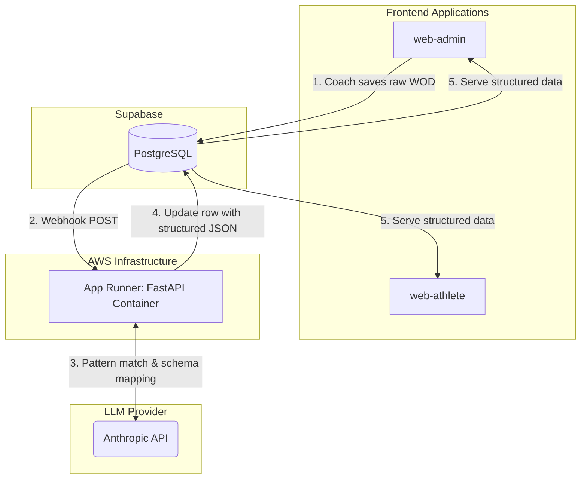

# WODAPP Monorepo

A full-stack platform for managing, structuring, and distributing CrossFit workouts. This monorepo contains the Svelte client applications, the Python parsing service, and the declarative infrastructure required to run the backend.

### Monorepo Structure

* `/web-admin`: Svelte 5 application for coaches and gym managers to write WODs, manage schedules, and review data.
* `/web-athlete`: Svelte 5 application serving structured workouts and logging capabilities to end-users (slated for future migration to native mobile applications).
* `/data`: Containerized Python backend utilizing FastAPI to process asynchronous database webhooks.
* `/infra`: Terraform configuration managing the AWS compute and registry infrastructure.

### Backend Architecture

The backend is a containerized Python backend service that ingests unstructured workout descriptions, applies light pattern matching, and interfaces with Claude's API to return structured JSON payloads.

The system transitions from a serverless function model to an always-on containerized architecture to eliminate cold starts and bypass strict HTTP execution timeouts during LLM inference.

* **Application:** FastAPI, Python 3.12.13
* **Package Management:** `uv`
* **Containerization:** Docker
* **Infrastructure as Code:** Terraform
* **Cloud Provider:** AWS (eu-west-3)
* **Compute:** AWS App Runner (1 vCPU, 2GB RAM)
* **CI/CD:** GitHub Actions

### System Pipeline



### System Flow

1. **Trigger:** Supabase database fires a webhook upon a new `INSERT` event in the target table.
2. **Ingestion:** FastAPI endpoint receives the payload and validates the webhook secret.
3. **Processing:** The application extracts the unstructured text and processes it.
4. **Response:** A structured JSON object is returned to the client.

### Infrastructure Deployment

The infrastructure is fully managed via Terraform. State is defined in the `/infra` directory.

Prerequisites:
* Terraform CLI
* Authenticated AWS CLI session

```bash
cd infra
terraform init
terraform plan
terraform apply